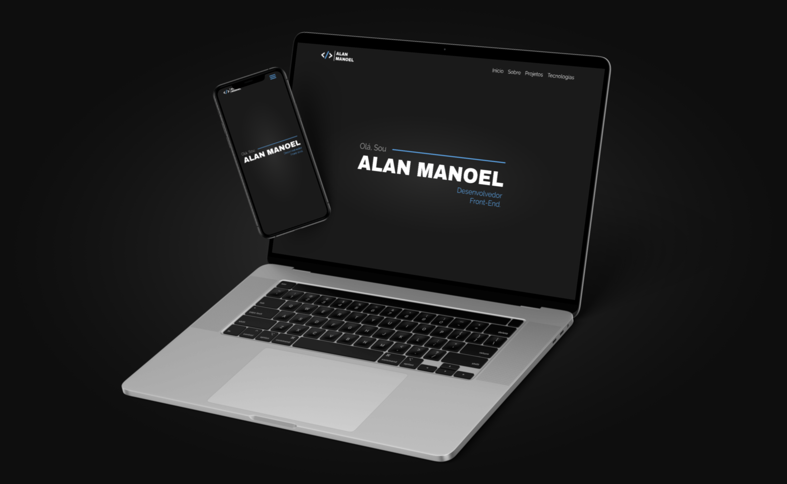
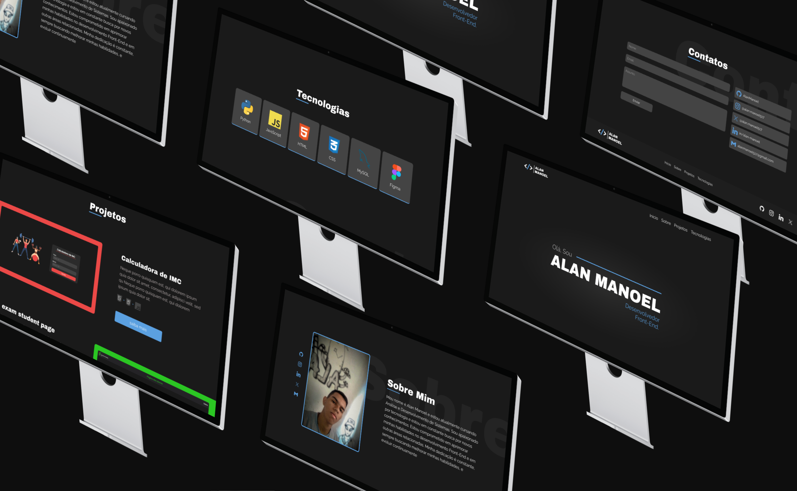

# Portifolio
### Screenshots

    
    
    

### Link da aplicação:
#### https://alanmanoel.github.io/Portfolio/
### Contribuição:
#### Contribuições são bem-vindas! Sinta-se à vontade para abrir uma issue ou enviar um pull request.

### Contato:

  
  
  
  

